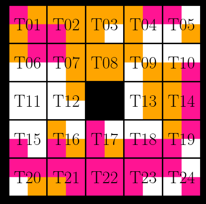

#Nitty Gritty Puzzle Solver

##What is Nitty Gritty?
Nitty Gritty is a tile based puzzle game where the goal is to arrange the tiles so that the colors of adjacent tiles match. This code is designed to find all possible solitions to this puzzle.

This code starts with an initial piece in the top left corner, and then determines all possible pieces that could be placed next to it, and saves those options. Then for each option, it determines all possible pieces that could be placed third, and saves those options. This process repeats for each option until no valid moves remain, or the final piece has been placed.

##How do I use the Code?
This code, Simulation.py (or Simulation.Multiprocessing.py if you'd like to use multiple processors) runs with python and requires the basic packages matplotlib, multiprocessing, numpy, os, pickle, sys, and time.

The code will prompt you for a starting tile and a starting rotation. Tiles are numbered 1-24 (pictured below) and have 4 possible rotations numbered 1-4, where the number represents how many 90o counter-clockwise rotations perform. Note that due to symmetry, tiles 1,9, and 24 only have 2 rotations and tiles 8,11, and 22 only have 1 rotation.

Since each tile pattern has a version for each permutation of the 3 colors, a single solution actually represents 6 solutions, one for each perumtation of (white,orange,magenta):

     

So in accounting for symmetry and color permutations, there are only 14 starting conditions that need to be simulated in order to find all possible solutions. The (starting piece, starting rotation) options are:

{(1,1), (2,1), (2,2), (2,3), (2,4), (4,1), (4,2), (4,3), (4,4), (5,1), (5,2), (8,1), (13,1), (13,2)}

##Code Outputs
When the code is running it will print out to the terminal the current step it's on, the number of valid moves it's analyzing, and how long the previous step took. This information is also written to a log-file in the "Logs/" directory. 

When to code finishes, any solutions that were found are written to a pickle file in the "Successes" directory. Additionally, the code will generate an graph in the "Plots/" directory (example below) showing the number of options at each step (in black) and the average time taken to analyze each option (in green).

The log, graphs, and pickle files have the following naming convention:
Logs.{starting tile number}.{starting tile rotation}.txt

##Imaging the Solutions
The script "PlotSolution.py" will generate images of the solved board, and save them to the "Plots/" directory. It will prompt you for a starting piece and rotation, and then it will tell you how many solutions exist for that initial condition. Tell it which solution you want to plot, and it will generate 6 images, one for each color permutation of the solution. The Plots have the following naming convention:
Board.{starting tile number}.{starting tile rotation}.{solution number}.C{number of color permutation}.png

Additionally, you can run the "CountSolutions.py" script to see how many solutions have been found from all completed simulations.